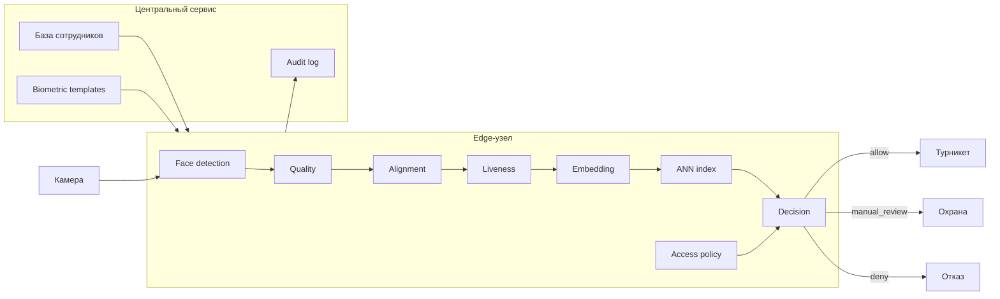

# Архитектура

Для архитектуры выбрана гибридная схема, состоящая из  edge-узла и центрального сервиса, которых синхронизуется с edge. Решение не зависит от сетевого щапроса в центр при каждом проходе и может укладываться во временное требование.


## Схема



## Проход
1. камера отправляет кадр на edge;
2. находится лицо;
3. проверяется качество;
4. выполняется alignment;
5. проверяется liveness;
6. получается embedding;
7. выполняется one-to-many поиск по локальному ANN-индексу;
8. проверяются match score, margin до второго кандидата и access policy;
9. принимается `allow`, `deny` или `manual_review`;
10. при `allow` отправляется команда турникету;
11. результат записывается в audit log.


## Edge и центральный сервис

На edge находятся компоненты, необходимые непосредственно для прохода:

- CV/ML inference;
- ANN-индекс;
- локальная копия access policy;
- decision logic;
- временный audit log для offline-режима.

В центре находятся:

- основная база сотрудников;
- основное хранилище embeddings;
- актуальные права доступа;
- центральный audit log.

## Хранение данных

Для распознавания хранятся embeddings лиц. Основная версия находится в центральном сервисе, нужная для поиска копия — на edge. Исходные изображения постоянно не хранятся. 
На edge embeddings нужны для локального ANN-поиска.

Audit log содержит как минимум:

- `event_id`;
- `gate_id`;
- `camera_id`;
- время;
- итоговое решение;
- `employee_id`, если найден;
- quality и liveness;
- match score;
- margin до второго кандидата;
- причины решения;
- признак manual/offline режима.

## Ручная проверка

`manual_review` используется, если автоматическому результату нельзя достаточно доверять. Например:

- плохой кадр;
- сомнительный liveness;
- низкий match score;
- маленький margin между двумя кандидатами;
- проблемы с актуальностью данных.

В этом случае `turnstile_command = open` не отправляется. Событие передаётся охране вместе с причиной.

## Offline и сбои

При потере сети edge может использовать локальный индекс и access policy.

Но если кеш слишком старый и нельзя подтвердить, что права сотрудника всё ещё актуальны, автоматический `allow` запрещён. Это важно, например, для ситуации, когда доступ сотрудника уже отозвали, а изменение ещё не дошло до проходной

## Обновление и отзыв доступа

Центральный сервис является источником актуального состояния сотрудников. Изменения embeddings и access policy передаются на edge. 

Отзыв доступа должен распространяться приоритетно. Если его актуальность нельзя подтвердить, используется `manual_review` или `deny`, но не `allow`.

## Что есть в PoC

```text
mock event
→ quality
→ liveness
→ embedding matching
→ decision
→ mock turnstile command
→ audit log
```

Face detection, quality, liveness и embeddings замоканы. ANN заменён обычным сравнением маленькой demo-базы.

Центральный сервис, реальные камеры и реальный турникет остаются частью целевой архитектуры, но не реализуются в PoC.